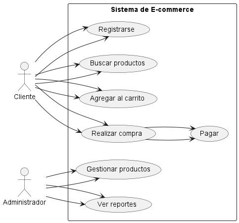
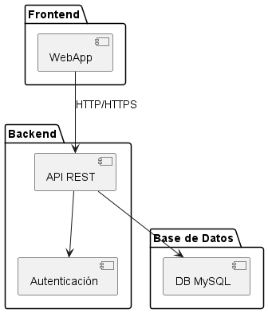
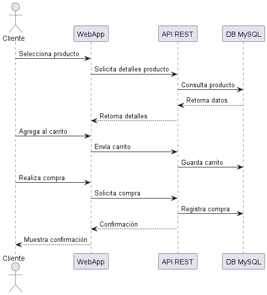

# Manual de Diagramas para Especificación de Requisitos

Este manual contiene tres diagramas fundamentales para la especificación de requisitos de sistemas de software: diagrama de casos de uso, diagrama de arquitectura general y diagrama de flujo de interacción. Cada sección incluye una explicación detallada y el ejemplo correspondiente.

---

## 1. Diagrama de Casos de Uso

### ¿Qué es?
El diagrama de casos de uso es una herramienta de modelado UML que permite visualizar las funcionalidades principales de un sistema desde la perspectiva del usuario (actor). Ayuda a identificar los requerimientos funcionales y a entender cómo los diferentes tipos de usuarios interactúan con el sistema.

### Explicación Profunda
- **Actores:** Representan los roles externos que interactúan con el sistema. En el ejemplo, tenemos dos actores: `Cliente` y `Administrador`.
- **Casos de uso:** Son las acciones o servicios que el sistema ofrece a los actores, como "Registrarse", "Buscar productos", "Agregar al carrito", "Realizar compra", "Pagar", "Gestionar productos" y "Ver reportes".
- **Relaciones:** Las flechas muestran qué actor puede ejecutar cada caso de uso. También se pueden mostrar relaciones entre casos de uso, como la dependencia de "Realizar compra" respecto a "Pagar".
- **Propósito:** Este diagrama permite identificar los requerimientos funcionales y delimitar el alcance del sistema.

### Ejemplo

---

## 2. Diagrama de Arquitectura General

### ¿Qué es?
El diagrama de arquitectura general describe la estructura global del sistema, mostrando los principales componentes y cómo se comunican entre sí. Es esencial para entender la organización técnica y las tecnologías involucradas.

### Explicación Profunda
- **Capas:** El ejemplo muestra una arquitectura de tres capas: `Frontend`, `Backend` y `Base de Datos`.
    - **Frontend:** Representa la interfaz de usuario, en este caso una `WebApp`.
    - **Backend:** Incluye la lógica de negocio y servicios, como `API REST` y `Autenticación`.
    - **Base de Datos:** Donde se almacena la información, aquí representada por `DB MySQL`.
- **Comunicación:** Las flechas indican el flujo de información entre los componentes, por ejemplo, la `WebApp` se comunica con la `API REST` mediante HTTP/HTTPS.
- **Propósito:** Este diagrama ayuda a definir la estructura técnica, facilita la toma de decisiones sobre tecnologías y soporta la escalabilidad y el mantenimiento del sistema.

### Ejemplo

---

## 3. Diagrama de Flujo de Interacción (Secuencia)

### ¿Qué es?
El diagrama de flujo de interacción, o diagrama de secuencia, muestra cómo los diferentes componentes y actores del sistema interactúan entre sí a lo largo del tiempo para completar un proceso específico.

### Explicación Profunda
- **Participantes:** Incluye tanto actores externos (`Cliente`) como componentes internos (`WebApp`, `API REST`, `DB MySQL`).
- **Mensajes:** Las flechas representan la comunicación entre los participantes, como solicitudes, respuestas y confirmaciones.
- **Secuencia temporal:** El diagrama sigue el orden cronológico de las interacciones, permitiendo identificar el flujo de información y posibles puntos de fallo o mejora.
- **Propósito:** Es útil para detallar procesos críticos, validar la lógica de negocio y detectar requisitos no funcionales como tiempos de respuesta o concurrencia.

### Ejemplo

---

## Recomendaciones para el uso de los diagramas
- Utiliza los diagramas de casos de uso para definir el alcance funcional y validar requerimientos con los usuarios.
- El diagrama de arquitectura es clave para la toma de decisiones técnicas y la planificación de la escalabilidad.
- Los diagramas de flujo de interacción ayudan a detallar procesos y detectar posibles mejoras o riesgos en la implementación.

Puedes generar estos diagramas con PlantUML o herramientas similares usando los archivos `.wsd` proporcionados en este proyecto.
